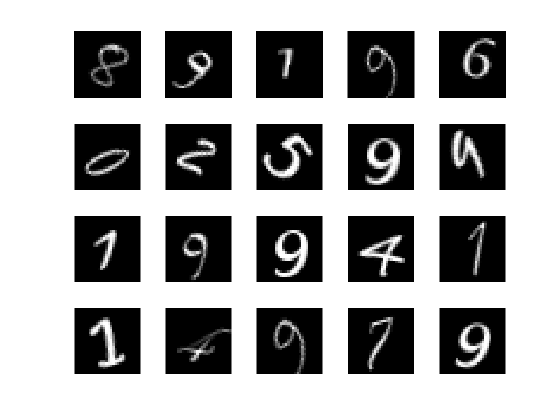

# Michael Gaiewski

This is my personal webpage for my MATH5800: Topics in Machine Learning class at the University of Connecticut

## Introduction

I along with my two group members, Sean O’Hagen and Adriana Vega-Molino, embarked on a project to study and develop algorithms used for image classification using the MNIST dataset. For context, the MNIST dataset is comprised of thousands of 28 x 28 pixel images of handwritten digits 0-9, corresponding matrices of grayscale pixel colors as 0-255 for each image, and a label of each digit to either train the algorithm or test to see if the digits the algorithm predict are correct. Often times we would split the dataset into “training” and “testing” sets where we would train the algorithm on the training set and see how accurate it was on the testing set. I performed all of my investigations in MATLAB, and the code I used is posted on my GitHub page.

Some examples of the MNIST data (colors are inverted). This image is from MATLAB.

## Logistic Regression

Our first algorithm we studied was a simple logistic regression. For starters we only considered classifying two digits at a time, in particular 0s and 1s. We wished to find a 784 x 1 vector of regression coefficients to use for a logistic function. This way when we input a 784 x 1 vector of grayscale pixel measurements from an entry in our test dataset, the algorithm would calculate the probabilities that the image was a 0 or a 1 and choose the digit with the higher probability as its prediction. To calculate this regression coefficient vector, we used a gradient descent on each of the 784 entries either until the algorithm reached its maximum defined number of iterations or the maximum magnitude of the element-wise difference between the regression vector from one iteration and the vector from the previous iteration was within a specified tolerance. This method proved to have a very high degree of accuracy of about 98-99%.

Next we updated our logistic regression algorithm to include all ten digits 0-9. We again used gradient descent but now our algorithm was in the multinomial case. We used a slight modification on the logistic function to calculate probabilities, the softmax function. The accuracy we were able to get here was still very high but more around 90-95% instead of the near perfect accuracy of the binary case.

## Visualizing Progress of Algorithm

### Logistic Regression

At this point, my group members and I began to take interest in different aspects of this overall project, so we began to diverge and separate into more individual research. My interest mainly concerned finding an answer to the question of how can one visualize the progress of an algorithm as it is trained. For the multinomial logistic regression, I was able to take the regression coefficients for each of the ten digits after each iteration of gradient descent, scale them to be between 0 and 255, and convert them into grayscale images. Interestingly enough, these images indeed looked like handwritten images 0-9 with darker colors at pixels that are more commonly used to make up a particular digit, and lighter colors around less common or seldom used pixels to make up a certain digit. 

### Densely Connected Neural Network

I then wished to see if I could use this idea of presenting this visualization on other types of machine learning algorithms. I found on a MATLAB discussion forum a multilayer perceptron densely connected neural network created by Johannes Langer. His code can be found here https://www.mathworks.com/matlabcentral/fileexchange/73010-mnist-neural
-network-training-and-testing. This algorithm contained two hidden layers, one with 80 neurons and one with 60 neurons. I noticed that if I took the weights from each layer which was 784 x 80, 80 x 60, 60 x 10 and matrix multiplied them, I would get a 784 x 10 matrix of weights which is what I was using for my function on the multinomial logistic regression. While later I realized I cannot simply use matrix multiplication because each weight gets sent to an activation function, the result still surprised me. I vaguely could make out the digits 0-9 using this method, not nearly as clearly as they were in the logistic regression, but still enough to get my attention. This appears to just be a coincidence but I still found it an interesting observation.

### Convolutional Neural Network

Lastly I looked at MATLAB’s own Convolutional Neural Network (CNN) example for the MNIST data using MATLAB’s Deep Learning Toolbox. I could not interpret the weights of the network as I had hoped to which finding a 784 x 10 matrix of weights, as that is not how a CNN works. However I looked at the first layer of the network after the input layer, the first convolutional layer, which found 8 different convolutional filter weights. I took one of the data entries in the test set, reshaped it, and computed the N-dimensional convolution of that data point and each of the 8 filters. I then rescaled the entries of each of the 8 resulting convolutions and converted them to grayscale images. I was able to find then what “shapes” of a digit were being looked for with each of the filters. Often times this looked like a horizontal, vertical, or diagonal line segment, which makes sense for the MNIST data.

